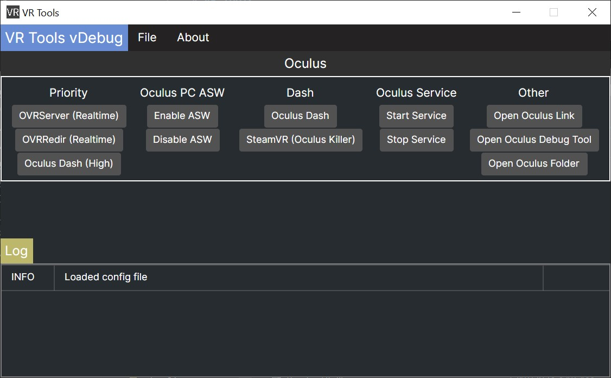

# VR Tools
A collection of useful tools for VR. Mainly focused towards Oculus headsets
## Notice
1. A custom Oculus software install path and [Oculus Killer](https://github.com/BnuuySolutions/OculusKiller) source can be configured in config.xml
2. This application requires running as administrator to function
## Features
* Change priority of programs to help reduce random stutters on some hardware
* Disable and re-enable Oculus Application Spacewarp via a registry entry
* Switch between Oculus Dash and [Oculus Killer](https://github.com/BnuuySolutions/OculusKiller)
* Start and stop Oculus service
* A few other random things

 
## Building
1. Download the latest [.NET SDK](https://dotnet.microsoft.com/en-us/download)
2. Download and extract the source code
3. Open powershell in the first `VR_Tools` folder (the one that contains VR_Tools.sln) and run `dotnet build .\VR_Tools.sln`
4. The .exe file is in `\VR_Tools\VR_Tools.Desktop\bin\Debug\net8.0\win-x64`